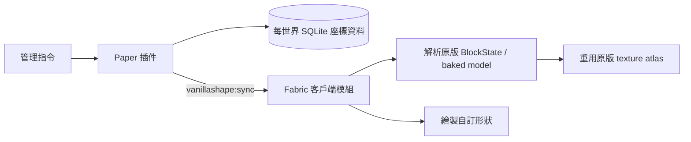

# VanillaShape

VanillaShape 是一套配對使用的 **PaperMC 插件 + Fabric 客戶端模組**。Paper 是特殊方塊的唯一資料來源，Fabric 則直接重用 Minecraft 已載入的原版方塊模型與紋理 atlas 來顯示形狀，因此玩家不需要安裝或下載資源包。

目前目標版本為 Minecraft / Paper / Fabric `26.2`，需要 Java 25。

## 功能

- 支援牆、柵欄、柵欄門、半磚、樓梯、門、地板門（trapdoor）與直立半磚。
- `model` 通用形狀可直接重用任意原版 baked model，因此同時涵蓋藤蔓、告示牌、按鈕、草／花、珊瑚、壓力板、拉桿、火把、梯子、鐵軌等原版模型類型與完整 BlockData 狀態。
- 形狀與材質彼此獨立；例如可製作鑽石礦材質的柵欄、橡木原木材質的樓梯。
- 接受完整原版 `BlockData`，例如 `minecraft:oak_log[axis=x]`，保留方向性紋理與 blockstate variant。
- 從實際 baked model 取得每一面的紋理，支援多層紋理、原版 tint、動畫與透明紋理。
- 固定形狀先計算盒子聯集，只提交真正外表面；同一造型內部及相鄰特殊方塊的接面不會重複畫透明紋理。
- 牆完整實作原版 `up` 與四向 `none/low/tall` 規則；上下堆疊及上方方塊碰撞形狀會正確影響柱與側邊高度。
- 不註冊伺服器未知的自訂方塊，也不傳送資源包。
- Paper 以 SQLite 按世界、X/Y/Z 儲存特殊方塊，重新啟動後仍會保留。
- 玩家加入或切換世界時完整同步；編輯時即時傳送增量更新。
- 特殊方塊有可堆疊的原版物品表示；物品 PDC 保存形狀、完整材質與狀態，右鍵即可放置，滑鼠中鍵可拾取目標狀態。
- 原版除錯棒可直接選取並循環特殊方塊的適用狀態；Shift 反向循環。
- 準星指向特殊方塊時可直接左鍵打掉；生存模式掉落保存完整形狀、材質與狀態的物品。
- 可用指令替換特殊方塊形狀、把原版方塊轉換成特殊方塊，或把特殊方塊還原成原版實體方塊。
- 門、地板門、柵欄門及通用模型中的門／按鈕／拉桿／可點燃狀態可以右鍵互動；按鈕會自動復位。
- `/vshape replacemode` 可切換右鍵材質替換模式，保留目標形狀與狀態，只套用主手方塊材質。
- 安裝 Axiom 時會透過官方 AxiomClientAPI 加入 `VanillaShape` 與 `VanillaShape Clipboard` Editor 工具；可放置、替換、刪除、兩角選取、複製與批次貼上特殊方塊。
- 可選整合 WorldEdit 7.4.5 或 FastAsyncWorldEdit 2.15.4：九種 `vanillashape:*` 方塊會進入參數補全，並支援 set、replace、mask、copy/cut/paste、旋轉／鏡像、Sponge v3 schematic 與 undo/redo。
- 直立半磚使用與原版樓梯一致的相對狀態：`straight`、`inner_left`、`inner_right`、`outer_left`、`outer_right`。Paper 會在相鄰方塊變更時重新計算狀態。
- 直立半磚貼在側面時會靠向被點擊的支撐方塊；點擊頂面或底面時依命中位置選擇東／西／南／北半，中央位置則依玩家朝向決定。放置後會像樓梯一樣自動形成內外角。
- 依需求，目前特殊方塊只有顯示效果，**沒有伺服器碰撞箱**；Paper 世界中的對應位置保持空氣。

材質語意參考 [SculptPlugin](https://github.com/TWME-TW/SculptPlugin)：保存完整 BlockData，依方塊狀態選擇原版模型，再解析方向性與分層紋理。VanillaShape 的實際渲染則完全在 Fabric 客戶端執行。

## 架構



`common` 子專案包含雙方共用的資料模型、版本化二進位協定及樓梯式連接規則。同步通道使用標準 Minecraft custom payload；實作方式可對照 [Paper plugin messaging](https://docs.papermc.io/paper/dev/plugin-messaging/) 與 [Fabric networking](https://docs.fabricmc.net/develop/networking)。

## 安裝

1. 在 Paper 26.2 伺服器安裝 `paper/build/libs/paper-0.5.0.jar`。
2. 每位需要看見與操作特殊方塊的玩家安裝 Fabric Loader、Fabric API 及 `fabric/build/libs/fabric-0.5.0.jar`。
3. 啟動伺服器。資料庫會建立於 `plugins/VanillaShape/blocks.db`。

若同時使用 Axiom：

- 客戶端照常安裝閉源 `Axiom` 模組；它已內含 AxiomClientAPI，不需要再手動安裝 API JAR。
- 伺服器可同時安裝 [AxiomPaperPlugin](https://github.com/Moulberry/AxiomPaperPlugin)。VanillaShape 以 `softdepend` 共存，且 Axiom 工具操作會額外遵守 `axiom.editor.use` 與 `axiom.build.place`。
- VanillaShape 是獨立資料層，沒有占用原版 BlockState 作為 carrier；因此請使用 Editor 內的 `VanillaShape` 工具編輯單格，或以 `VanillaShape Clipboard` 複製／貼上選區。

沒有安裝 Fabric 模組的玩家仍可連線，但特殊方塊位置在他們眼中是空氣。

## 使用方式

所有指令需要 `vanillashape.admin`（預設僅 OP）。放置時看著一個原版方塊的表面，特殊方塊會建立在相鄰的空氣位置。

```text
/vshape place <wall|fence|fence_gate|slab|stairs|door|trapdoor|vertical_slab> [blockdata]
/vshape place model <vanilla-model-blockdata> [material-blockdata]
/vshape remove
/vshape material <blockdata>
/vshape state <property> <value>
/vshape give <shape> [blockdata] [amount]
/vshape give model <vanilla-model-blockdata> [material-blockdata] [amount]
/vshape palette [blockdata]
/vshape replace <shape> [blockdata]
/vshape replacemode [on|off|toggle]
/vshape convert <shape> [blockdata]
/vshape restore
/vshape inspect
/vshape list
```

若省略 `blockdata`，會使用主手非空氣方塊物品的完整 BlockData；空手或手持非方塊時，指令會要求明確指定材質，絕不回退成石頭。

範例：

```text
/vshape place vertical_slab minecraft:bricks
/vshape place stairs minecraft:oak_log[axis=x]
/vshape material minecraft:diamond_ore
/vshape state facing east
/vshape state open true
/vshape palette minecraft:polished_andesite
/vshape replace fence minecraft:oak_planks
/vshape give model minecraft:oak_button[face=wall,facing=north,powered=false] minecraft:glass
/vshape convert model minecraft:diamond_block
/vshape replacemode on
```

移除、修改材質與修改狀態時，直接將準星對準 Fabric 顯示的特殊方塊。

### 物品欄與拾取

`/vshape palette [blockdata]` 會把八種固定形狀各一個放進玩家物品欄；`/vshape give model ...` 可取得任意原版模型形狀，`/vshape give` 則可取得指定形狀與數量。物品本身仍是原版方塊物品，所以不需要資源包，但名稱、說明與 PDC 會標記其 VanillaShape 形狀、模型、材質和狀態。

### 互動與材質替換

- 空手或拿一般物品右鍵門、地板門、柵欄門，可切換開關。
- `model` 形狀若其 BlockData 實作原版 `Openable`、`Powerable` 或 `Lightable`，右鍵會切換對應狀態；按鈕在 20 tick 後自動復位。
- `/vshape replacemode on` 後，主手拿方塊物品右鍵任一 VanillaShape 方塊，會保留幾何與狀態並把 `material` 換成該物品的完整 BlockData。`off` 關閉，`toggle` 或省略參數可切換。
- 互動是虛擬狀態操作；由於 backing block 仍是空氣，目前不輸出實體紅石訊號，也不提供壓力板踩踏偵測。

- 拿著物品右鍵原版方塊表面：放在相鄰空氣格。
- 拿著物品右鍵既有特殊方塊：沿命中的面相鄰放置。
- 準星對著特殊方塊按滑鼠中鍵：把該方塊的完整形狀、材質與狀態取到物品欄。
- 生存模式會消耗物品；創造模式不消耗。
- 除錯棒以外的物品或空手左鍵特殊方塊會立即移除它；生存／冒險模式掉落該方塊的精確狀態物品，創造模式不掉落。

### 除錯棒

主手拿原版除錯棒並指向特殊方塊：

- 左鍵選擇下一個可用狀態欄位。
- 右鍵循環目前欄位的值。
- 按住 Shift 時反向選擇／循環。

可用欄位依形狀限制。例如牆與柵欄支援 `north/east/south/west`，樓梯支援 `facing/half/corner/waterlogged`，門支援 `facing/open/hinge/powered`。門的上下半部會一起更新。除錯棒與 `/vshape state` 都是精確寫入：修改當下不會觸發鄰居更新或覆寫手動值；之後若真的放置、移除或改動相鄰方塊，連接與角落狀態才會按自動連接規則重算。

### Axiom Editor

VanillaShape 使用 [AxiomClientAPI](https://github.com/Moulberry/AxiomClientAPI) 的公開 `CustomTool` 介面，沒有修改或反編譯 Axiom 本體。進入 Axiom Editor 後選擇 `VanillaShape` 工具，主手拿一個 VanillaShape 物品：

- 右鍵：在準星所指表面放置。
- Enter：用主手物品替換準星所指的特殊方塊。
- Delete：刪除準星所指的特殊方塊。

預覽選取框由 Axiom 的 Region API 繪製；真正寫入仍由 Paper 驗證世界邊界、主手物品和權限後保存至 SQLite。

若要複製選區，改選 `VanillaShape Clipboard` 工具：

1. 依序右鍵選取兩個對角。
2. 按 Enter 複製選區內的完整 VanillaShape 記錄。
3. 右鍵一個表面，將相鄰格設為貼上原點。
4. 按 Enter 貼上；可繼續選擇其他原點重複貼上。
5. 按 Delete 清除選區與剪貼簿。

剪貼簿由 Paper 按玩家保存，貼上會在單一 SQLite transaction 中保留 shape、material、model、方向、corner 與 flags；選區內沒有複製到特殊方塊的位置會視為虛擬空氣。為避免建立同格兩種世界狀態，若目標特殊方塊位置已有真實原版方塊，操作會拒絕並指出座標。選區上限為 16,777,216 格體積／100,000 個特殊方塊。技術研究與公開 API 邊界見 [`docs/AXIOM_INTEGRATION.md`](docs/AXIOM_INTEGRATION.md)。

### 權限

| 權限 | 用途 | 預設 |
|---|---|---|
| `vanillashape.admin` | `/vshape` 管理指令 | OP |
| `vanillashape.use` | 從物品欄放置 | OP |
| `vanillashape.items` | 中鍵取得特殊方塊物品 | OP |
| `vanillashape.debugstick` | 除錯棒編輯狀態 | OP |
| `vanillashape.break` | 直接打掉特殊方塊 | OP |
| `vanillashape.axiom` | Axiom 的 VanillaShape 工具 | OP |
| `vanillashape.worldedit` | 在 WorldEdit／FAWE 使用 `vanillashape:*` | OP |

### WorldEdit / FastAsyncWorldEdit

只要在 Paper 端另外安裝 WorldEdit 或 FAWE，VanillaShape 就會自動啟用整合，不需要額外橋接插件。可用的方塊 ID：

```text
vanillashape:wall
vanillashape:fence
vanillashape:fence_gate
vanillashape:slab
vanillashape:stairs
vanillashape:door
vanillashape:trapdoor
vanillashape:vertical_slab
vanillashape:model
```

通用模型範例：

```text
//set vanillashape:model{model:"minecraft:oak_button[face=wall,facing=east,powered=false]",material:"minecraft:glass"}
//set vanillashape:model{model:"minecraft:vine[north=true]",material:"minecraft:warped_planks"}
```

在 WorldEdit／FAWE 中省略 `material` 時，會使用主手非空氣方塊物品的完整 BlockData；主控台或空手必須寫出 `material:"..."`。其餘未指定狀態仍是 `north`、`straight` 與全 false。`model` 另外必須明確給出 `model:"..."`。WorldEdit 的完整狀態使用 SNBT：

```text
//set vanillashape:vertical_slab{material:"minecraft:oak_log[axis=x]",facing:"east",corner:"straight"}
//replace vanillashape:vertical_slab vanillashape:stairs{material:"minecraft:deepslate",facing:"west",half:"top"}
```

FAWE 的 rich parser 會把材質 BlockData 的 `[]` 當成自己的語法，因此帶狀態的項目需多包一層中括號；只寫 shape 時不需要：

```text
//set vanillashape:vertical_slab[{material:"minecraft:oak_log[axis=x]",facing:"east"}]
//replace vanillashape:vertical_slab[{material:"minecraft:oak_log[axis=x]"}] minecraft:stone
```

shape-only mask 會匹配該形狀的所有材質；指定欄位時只比較指定欄位。寫入經單一 SQLite transaction 批次提交，世界中的 backing block 仍是空氣。`//undo`／`//redo`、一般 `//copy`／`//cut`／`//paste`、`//rotate`／`//flip` 和 Sponge v3 schematic 會保存完整狀態。技術原理、ItemsAdder-WorldEdit 拆包比較與已驗證範圍見 [`docs/WORLDEDIT_FAWE_INTEGRATION.md`](docs/WORLDEDIT_FAWE_INTEGRATION.md)。

FAWE 的 copy 會在背景完成。VanillaShape 會記住命令前的 clipboard，並用每個 session 的 generation 等待本次命令真正建立的新 clipboard 後才附加 proxy NBT；連續執行複製也不會把舊 snapshot 包到新結果。這避免 oak stairs／wall 等只應存在於 clipboard 的 carrier 被真正貼進伺服器世界。

## 編譯與測試

```bash
./gradlew clean build
```

產物：

- Paper：`paper/build/libs/paper-0.5.0.jar`（已內含 relocated SQLite JDBC）
- Fabric：`fabric/build/libs/fabric-0.5.0.jar`

測試涵蓋雙向 wire protocol、Axiom 選區／貼上座標安全、任意模型資料、版本與尾端資料拒絕、放置面與命中位置驗證、除錯棒狀態 schema、原版牆狀態、外表面聯集、直立半磚方向與內外角、柵欄門幾何、neutral overlay、虛擬幾何 raycast，以及 WorldEdit／FAWE 的 proxy、mask、history、磁碟 clipboard、非同步 clipboard generation、旋轉、schematic 和批次寫入。協定已升級為 v6；Paper 與 Fabric 必須一起更新至 0.5.0。

## 已知限制與下一步

- 目前沒有伺服器碰撞箱、硬度或漸進式破壞動畫；左鍵會立即移除並在非創造模式掉落精確狀態物品。
- 同步目前採「進入世界時全量 + 編輯時增量」，尚未按玩家追蹤中的 chunk 分片。
- 顯示幾何在每個畫面提交；大量方塊的下一階段應改成按 chunk 快取 mesh。
- 水浸狀態已納入協定，但尚未繪製額外水體。
- `model` 支援原版 JSON baked model；告示牌文字、旗幟圖案、箱子／床等 block-entity 動態 renderer 內容不屬於 baked model，目前只會顯示其可取得的靜態模型部分。
- 沒有 Fabric 模組的玩家無法看到特殊方塊，這是無資源包方案的必要取捨。
- Axiom 內建 clipboard 只序列化真實原版 BlockState，公開 API 沒有第三方 clipboard payload hook；虛擬方塊請使用整合提供的 `VanillaShape Clipboard` 工具。它目前不會與同一選區的原版方塊混成單一剪貼簿，也不會進入 Axiom 內建 undo stack。
- WorldEdit／FAWE 的一般選區命令已支援；只直接枚舉 Minecraft 原生 `BlockType.REGISTRY`、完全不使用 WorldEdit parser 的第三方 GUI 仍看不到虛擬 ID。

## 授權

[MIT](LICENSE)
