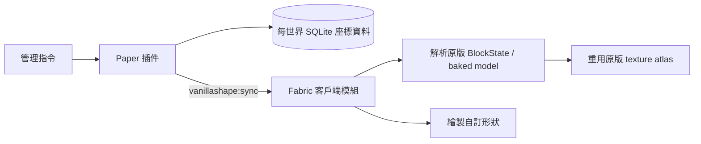

# VanillaShape

VanillaShape 是一套配對使用的 **PaperMC 插件 + Fabric 客戶端模組**。Paper 是特殊方塊的唯一資料來源，Fabric 則直接重用 Minecraft 已載入的原版方塊模型與紋理 atlas 來顯示形狀，因此玩家不需要安裝或下載資源包。

目前目標版本為 Minecraft / Paper / Fabric `26.2`，需要 Java 25。

## 功能

- 支援牆、柵欄、柵欄門、半磚、樓梯、門、地板門（trapdoor）與直立半磚。
- 形狀與材質彼此獨立；例如可製作鑽石礦材質的柵欄、橡木原木材質的樓梯。
- 接受完整原版 `BlockData`，例如 `minecraft:oak_log[axis=x]`，保留方向性紋理與 blockstate variant。
- 從實際 baked model 取得每一面的紋理，支援多層紋理、原版 tint、動畫與透明紋理。
- 不註冊伺服器未知的自訂方塊，也不傳送資源包。
- Paper 以 SQLite 按世界、X/Y/Z 儲存特殊方塊，重新啟動後仍會保留。
- 玩家加入或切換世界時完整同步；編輯時即時傳送增量更新。
- 直立半磚使用與原版樓梯一致的相對狀態：`straight`、`inner_left`、`inner_right`、`outer_left`、`outer_right`。Paper 會在相鄰方塊變更時重新計算狀態。
- 依需求，目前特殊方塊只有顯示效果，**沒有伺服器碰撞箱**；Paper 世界中的對應位置保持空氣。

材質語意參考 [SculptPlugin](https://github.com/TWME-TW/SculptPlugin)：保存完整 BlockData，依方塊狀態選擇原版模型，再解析方向性與分層紋理。VanillaShape 的實際渲染則完全在 Fabric 客戶端執行。

## 架構



`common` 子專案包含雙方共用的資料模型、版本化二進位協定及樓梯式連接規則。同步通道使用標準 Minecraft custom payload；實作方式可對照 [Paper plugin messaging](https://docs.papermc.io/paper/dev/plugin-messaging/) 與 [Fabric networking](https://docs.fabricmc.net/develop/networking)。

## 安裝

1. 在 Paper 26.2 伺服器安裝 `paper/build/libs/paper-0.1.0.jar`。
2. 每位需要看見特殊方塊的玩家安裝 Fabric Loader、Fabric API 及 `fabric/build/libs/fabric-0.1.0.jar`。
3. 啟動伺服器。資料庫會建立於 `plugins/VanillaShape/blocks.db`。

沒有安裝 Fabric 模組的玩家仍可連線，但特殊方塊位置在他們眼中是空氣。

## 使用方式

所有指令需要 `vanillashape.admin`（預設僅 OP）。放置時看著一個原版方塊的表面，特殊方塊會建立在相鄰的空氣位置。

```text
/vshape place <wall|fence|fence_gate|slab|stairs|door|trapdoor|vertical_slab> [blockdata]
/vshape remove
/vshape material <blockdata>
/vshape state <facing|top|open|hinge|waterlogged> <value>
/vshape inspect
/vshape list
```

若省略 `blockdata`，會使用主手方塊物品的完整 BlockData；主手不是方塊時使用石頭。

範例：

```text
/vshape place vertical_slab minecraft:bricks
/vshape place stairs minecraft:oak_log[axis=x]
/vshape material minecraft:diamond_ore
/vshape state facing east
/vshape state open true
```

移除、修改材質與修改狀態時，直接將準星對準 Fabric 顯示的特殊方塊。

## 編譯與測試

```bash
./gradlew clean build
```

產物：

- Paper：`paper/build/libs/paper-0.1.0.jar`（已內含 relocated SQLite JDBC）
- Fabric：`fabric/build/libs/fabric-0.1.0.jar`

測試涵蓋 wire protocol 往返、版本拒絕、直立半磚的內外角狀態，以及直立半磚幾何與旋轉。專案也已用 Paper 26.2 build 119 實際啟動，確認插件可載入、SQLite 可建表並能正常關閉。

## 已知限制與下一步

- 目前沒有碰撞、伺服器端選取框、破壞動畫或生存模式掉落；管理以指令完成。
- 同步目前採「進入世界時全量 + 編輯時增量」，尚未按玩家追蹤中的 chunk 分片。
- 顯示幾何在每個畫面提交；大量方塊的下一階段應改成按 chunk 快取 mesh。
- 水浸狀態已納入協定，但尚未繪製額外水體。
- 沒有 Fabric 模組的玩家無法看到特殊方塊，這是無資源包方案的必要取捨。

## 授權

[MIT](LICENSE)
