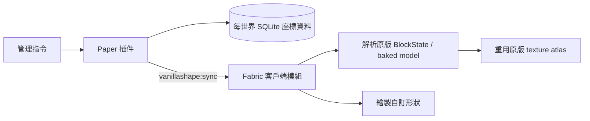

# VanillaShape

VanillaShape 是一套配對使用的 **PaperMC 插件 + Fabric 客戶端模組**。Paper 是特殊方塊的唯一資料來源，Fabric 則直接重用 Minecraft 已載入的原版方塊模型與紋理 atlas 來顯示形狀，因此玩家不需要安裝或下載資源包。

目前目標版本為 Minecraft / Paper / Fabric `26.2`，需要 Java 25。

## 功能

- 支援牆、柵欄、柵欄門、半磚、樓梯、門、地板門（trapdoor）與直立半磚。
- 形狀與材質彼此獨立；例如可製作鑽石礦材質的柵欄、橡木原木材質的樓梯。
- 接受完整原版 `BlockData`，例如 `minecraft:oak_log[axis=x]`，保留方向性紋理與 blockstate variant。
- 從實際 baked model 取得每一面的紋理，支援多層紋理、原版 tint、動畫與透明紋理。
- 不註冊伺服器未知的自訂方塊，也不傳送資源包。
- Paper 以 SQLite 按世界、X/Y/Z 儲存特殊方塊，重新啟動後仍會保留。
- 玩家加入或切換世界時完整同步；編輯時即時傳送增量更新。
- 特殊方塊有可堆疊的原版物品表示；物品 PDC 保存形狀、完整材質與狀態，右鍵即可放置，滑鼠中鍵可拾取目標狀態。
- 原版除錯棒可直接選取並循環特殊方塊的適用狀態；Shift 反向循環。
- 可用指令替換特殊方塊形狀、把原版方塊轉換成特殊方塊，或把特殊方塊還原成原版實體方塊。
- 安裝 Axiom 時會透過官方 AxiomClientAPI 加入 `VanillaShape` Editor 工具；可放置、替換與刪除特殊方塊。
- 直立半磚使用與原版樓梯一致的相對狀態：`straight`、`inner_left`、`inner_right`、`outer_left`、`outer_right`。Paper 會在相鄰方塊變更時重新計算狀態。
- 直立半磚貼在側面時會靠向被點擊的支撐方塊；點擊頂面或底面時依命中位置選擇東／西／南／北半，中央位置則依玩家朝向決定。放置後會像樓梯一樣自動形成內外角。
- 依需求，目前特殊方塊只有顯示效果，**沒有伺服器碰撞箱**；Paper 世界中的對應位置保持空氣。

材質語意參考 [SculptPlugin](https://github.com/TWME-TW/SculptPlugin)：保存完整 BlockData，依方塊狀態選擇原版模型，再解析方向性與分層紋理。VanillaShape 的實際渲染則完全在 Fabric 客戶端執行。

## 架構



`common` 子專案包含雙方共用的資料模型、版本化二進位協定及樓梯式連接規則。同步通道使用標準 Minecraft custom payload；實作方式可對照 [Paper plugin messaging](https://docs.papermc.io/paper/dev/plugin-messaging/) 與 [Fabric networking](https://docs.fabricmc.net/develop/networking)。

## 安裝

1. 在 Paper 26.2 伺服器安裝 `paper/build/libs/paper-0.2.1.jar`。
2. 每位需要看見與操作特殊方塊的玩家安裝 Fabric Loader、Fabric API 及 `fabric/build/libs/fabric-0.2.1.jar`。
3. 啟動伺服器。資料庫會建立於 `plugins/VanillaShape/blocks.db`。

若同時使用 Axiom：

- 客戶端照常安裝閉源 `Axiom` 模組；它已內含 AxiomClientAPI，不需要再手動安裝 API JAR。
- 伺服器可同時安裝 [AxiomPaperPlugin](https://github.com/Moulberry/AxiomPaperPlugin)。VanillaShape 以 `softdepend` 共存，且 Axiom 工具操作會額外遵守 `axiom.editor.use` 與 `axiom.build.place`。
- VanillaShape 是獨立資料層，沒有占用原版 BlockState 作為 carrier；因此 Axiom 的一般原版 Replace 工具不會誤改空氣中的特殊方塊，請改用 Editor 內的 `VanillaShape` 工具。

沒有安裝 Fabric 模組的玩家仍可連線，但特殊方塊位置在他們眼中是空氣。

## 使用方式

所有指令需要 `vanillashape.admin`（預設僅 OP）。放置時看著一個原版方塊的表面，特殊方塊會建立在相鄰的空氣位置。

```text
/vshape place <wall|fence|fence_gate|slab|stairs|door|trapdoor|vertical_slab> [blockdata]
/vshape remove
/vshape material <blockdata>
/vshape state <property> <value>
/vshape give <shape> [blockdata] [amount]
/vshape palette [blockdata]
/vshape replace <shape> [blockdata]
/vshape convert <shape> [blockdata]
/vshape restore
/vshape inspect
/vshape list
```

若省略 `blockdata`，會使用主手方塊物品的完整 BlockData；主手不是方塊時使用石頭。

範例：

```text
/vshape place vertical_slab minecraft:bricks
/vshape place stairs minecraft:oak_log[axis=x]
/vshape material minecraft:diamond_ore
/vshape state facing east
/vshape state open true
/vshape palette minecraft:polished_andesite
/vshape replace fence minecraft:oak_planks
```

移除、修改材質與修改狀態時，直接將準星對準 Fabric 顯示的特殊方塊。

### 物品欄與拾取

`/vshape palette [blockdata]` 會把八種形狀各一個放進玩家物品欄；`/vshape give` 可取得指定形狀與數量。物品本身仍是原版方塊物品，所以不需要資源包，但名稱、說明與 PDC 會標記其 VanillaShape 形狀和狀態。

- 拿著物品右鍵原版方塊表面：放在相鄰空氣格。
- 拿著物品右鍵既有特殊方塊：沿命中的面相鄰放置。
- 準星對著特殊方塊按滑鼠中鍵：把該方塊的完整形狀、材質與狀態取到物品欄。
- 生存模式會消耗物品；創造模式不消耗。

### 除錯棒

主手拿原版除錯棒並指向特殊方塊：

- 左鍵選擇下一個可用狀態欄位。
- 右鍵循環目前欄位的值。
- 按住 Shift 時反向選擇／循環。

可用欄位依形狀限制。例如牆與柵欄支援 `north/east/south/west`，樓梯支援 `facing/half/corner/waterlogged`，門支援 `facing/open/hinge/powered`。門的上下半部會一起更新。除錯棒與 `/vshape state` 都是精確寫入：修改當下不會觸發鄰居更新或覆寫手動值；之後若真的放置、移除或改動相鄰方塊，連接與角落狀態才會按自動連接規則重算。

### Axiom Editor

VanillaShape 使用 [AxiomClientAPI](https://github.com/Moulberry/AxiomClientAPI) 的公開 `CustomTool` 介面，沒有修改或反編譯 Axiom 本體。進入 Axiom Editor 後選擇 `VanillaShape` 工具，主手拿一個 VanillaShape 物品：

- 右鍵：在準星所指表面放置。
- Enter：用主手物品替換準星所指的特殊方塊。
- Delete：刪除準星所指的特殊方塊。

預覽選取框由 Axiom 的 Region API 繪製；真正寫入仍由 Paper 驗證世界邊界、主手物品和權限後保存至 SQLite。

### 權限

| 權限 | 用途 | 預設 |
|---|---|---|
| `vanillashape.admin` | `/vshape` 管理指令 | OP |
| `vanillashape.use` | 從物品欄放置 | OP |
| `vanillashape.items` | 中鍵取得特殊方塊物品 | OP |
| `vanillashape.debugstick` | 除錯棒編輯狀態 | OP |
| `vanillashape.axiom` | Axiom 的 VanillaShape 工具 | OP |

### WorldEdit / FastAsyncWorldEdit 研究

VanillaShape 的世界 carrier 是空氣，不能把不存在的 `vanillashape:*` ID 直接註冊成 WorldEdit `BlockType`。可行整合方式是註冊自訂輸入解析器來提供名稱與指令補全，再用 EditSession extent 在 WorldEdit 與 SQLite 資料層之間轉換帶 NBT 的原版 proxy。針對 WorldEdit、FAWE 與提供的 ItemsAdder-WorldEdit 實例之完整拆包結論、歷史／schematic／非同步批次設計，見 [`docs/WORLDEDIT_FAWE_INTEGRATION.md`](docs/WORLDEDIT_FAWE_INTEGRATION.md)。

## 編譯與測試

```bash
./gradlew clean build
```

產物：

- Paper：`paper/build/libs/paper-0.2.1.jar`（已內含 relocated SQLite JDBC）
- Fabric：`fabric/build/libs/fabric-0.2.1.jar`

測試涵蓋雙向 wire protocol、版本與尾端資料拒絕、放置面與命中位置驗證、除錯棒狀態 schema、直立半磚的方向與內外角狀態、幾何旋轉、neutral overlay，以及虛擬幾何 raycast。協定 v3 需要 Paper 與 Fabric 兩端一起更新至 0.2.1。

## 已知限制與下一步

- 目前沒有碰撞、破壞動畫或一般工具的生存模式掉落；物品放置與拾取已支援。
- 同步目前採「進入世界時全量 + 編輯時增量」，尚未按玩家追蹤中的 chunk 分片。
- 顯示幾何在每個畫面提交；大量方塊的下一階段應改成按 chunk 快取 mesh。
- 水浸狀態已納入協定，但尚未繪製額外水體。
- 沒有 Fabric 模組的玩家無法看到特殊方塊，這是無資源包方案的必要取捨。
- Axiom 原生工具只認得實際世界的原版方塊；虛擬方塊請使用整合提供的 `VanillaShape` 工具。
- WorldEdit / FAWE 整合目前完成可行性與參考實作研究，尚未在正式產物啟用；不能安全地用偽造 `BlockType` 取代 parser + proxy extent。

## 授權

[MIT](LICENSE)
